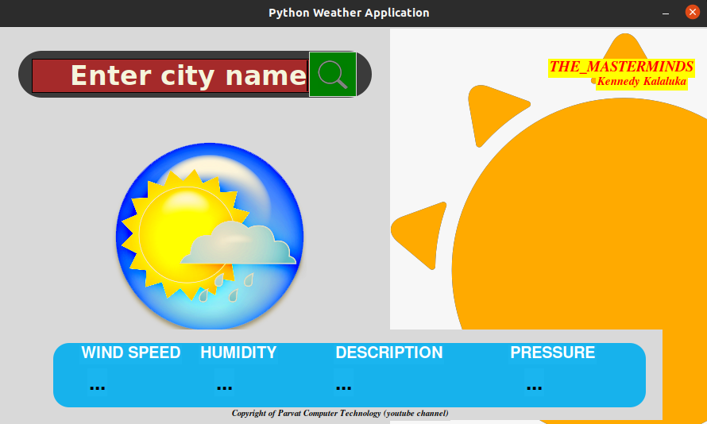
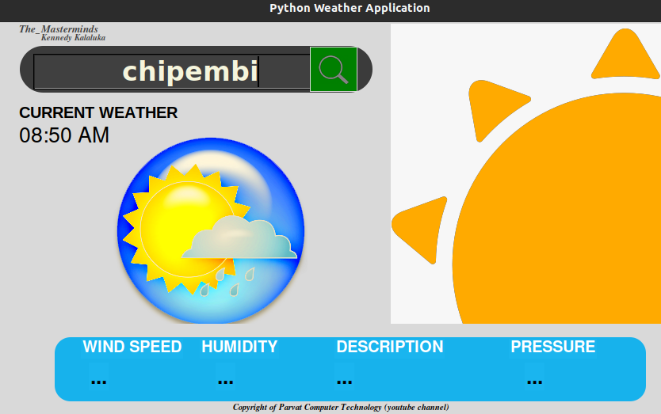
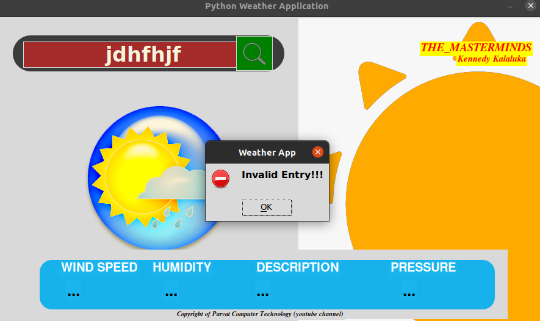
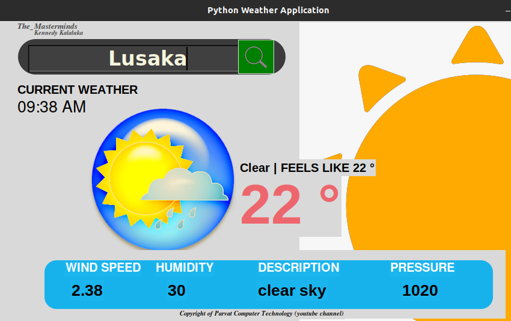

## Welcome to Weather Application
This application is meant to give you a current weather update for any city covered by OpenWeatherMap API.

You can install it through this link [Download Weather App](https://github.com/Kenmind/python-weather_application) to start checking weather forecasts on the go and through the press of a single button.

### Features

Weather Application provides some cool features, some are;

#### Current Time
- Through the help of Timezone, we provide the current time for the city you are checking the weather forecast.

#### Error Message Display
- The app displays an error message if the provided city cannot be accessed by the app

#### Variety of Details
- The app shows a lot of details such as wind speed, sky condition, temperature etc

### About

This app was an inspiration from the inconvinience of visiting a city and finding an unexpected weather condition. To avoid getting stranded in a different city, we provide you with the current weather update before you can visit the city so that you can prepare yourself.
_Developed in 2022_

This was developed by **Kennedy Kalaluka** [LinkedIn](https://www.linkedin.com/in/kennedykalaluka), [Github](https://github.com/Kenmind), [Twitter](https://www.twitter.com/Kennedy_Sibeso), [Facebook](https://www.facebook.com/kennedysimasiku.kalalukasibeso)

### Video From The Sole Team Member

